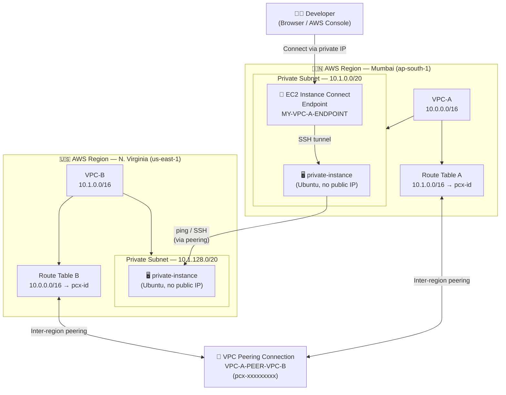

# AWS VPC Peering — Mumbai (VPC-A) ↔ N. Virginia (VPC-B) via EC2 Instance Connect Endpoint

> **Goal:** Establish private connectivity between two VPCs across AWS regions using VPC Peering and EC2 Instance Connect Endpoint — without assigning public IPs to any EC2 instance.

---

## Architecture Diagram



---

## Prerequisites

| Requirement | Detail |
|---|---|
| AWS Account | With permissions for VPC, EC2, and Endpoints |
| AWS Regions | Mumbai (`ap-south-1`) and N. Virginia (`us-east-1`) |
| Key Pair | Create or import one in each region for SSH |

---

## Step 1 — Create VPC-A in Mumbai

1. Open the **AWS Console** → set region to **Mumbai (`ap-south-1`)**.
2. Navigate to **VPC** → **Your VPCs** → **Create VPC**.
3. Configure:
   - **Name tag:** `VPC-A`
   - **IPv4 CIDR block:** `10.0.0.0/16`
4. Click **Create VPC**.

---

## Step 2 — Create a Private Subnet in VPC-A

1. Go to **VPC** → **Subnets** → **Create Subnet**.
2. Configure:
   - **VPC:** `VPC-A`
   - **Subnet name:** `private-subnet`
   - **IPv4 CIDR block:** `10.1.0.0/20`
3. Click **Create Subnet**.

> ⚠️ **Note:** Do **not** enable auto-assign public IPv4 for this subnet — it should remain fully private.

---

## Step 3 — Launch EC2 Instance in VPC-A (Mumbai)

1. Navigate to **EC2** → **Launch Instances**.
2. Configure:
   - **Name:** `private-instance`
   - **AMI:** Ubuntu Server (latest LTS)
   - **Instance type:** `t2.micro` (or as needed)
3. Under **Network Settings**:
   - **VPC:** `VPC-A`
   - **Subnet:** `private-subnet`
   - **Auto-assign Public IP:** **Disable**
4. Under **Security Group**, create a new group with:

   | Type | Protocol | Port | Source |
   |---|---|---|---|
   | SSH | TCP | 22 | 0.0.0.0/0 |
   | All ICMP – IPv4 | ICMP | All | 0.0.0.0/0 |

5. Click **Launch Instance**.

> 📝 **Note the private IP address** of this instance — you will need it later.

---

## Step 4 — Create EC2 Instance Connect Endpoint for VPC-A

1. Navigate to **VPC** → **Endpoints** → **Create Endpoint**.
2. Configure:
   - **Name tag:** `MY-VPC-A-ENDPOINT`
   - **Service category:** `EC2 Instance Connect Endpoint`
   - **VPC:** `VPC-A`
   - **Security Group:** Select the security group attached to `private-instance`
   - **Subnet:** `private-subnet`
3. Click **Create Endpoint**.

> ⏳ **Wait ~5 minutes** for the endpoint status to change to **Available** before proceeding.

### Connect to the Mumbai EC2 Instance

1. Go to **EC2** → select `private-instance` → click **Connect**.
2. Choose **EC2 Instance Connect** tab.
3. Select **Connect using EC2 Instance Connect Endpoint**.
4. Choose `MY-VPC-A-ENDPOINT` from the dropdown.
5. Click **Connect**.

You now have a shell session on a fully private EC2 instance — no public IP required. ✅

---

## Step 5 — Create VPC-B in N. Virginia

1. Open a **new browser tab** → switch region to **N. Virginia (`us-east-1`)**.
2. Navigate to **VPC** → **Your VPCs** → **Create VPC**.
3. Configure:
   - **Name tag:** `VPC-B`
   - **IPv4 CIDR block:** `10.1.0.0/16`
4. Click **Create VPC**.

---

## Step 6 — Create a Private Subnet in VPC-B

1. Go to **VPC** → **Subnets** → **Create Subnet**.
2. Configure:
   - **VPC:** `VPC-B`
   - **Subnet name:** `private-subnet`
   - **IPv4 CIDR block:** `10.1.128.0/20`
3. Click **Create Subnet**.

---

## Step 7 — Launch EC2 Instance in VPC-B (N. Virginia)

1. Navigate to **EC2** → **Launch Instances**.
2. Configure:
   - **Name:** `private-instance`
   - **AMI:** Ubuntu Server (latest LTS)
   - **Instance type:** `t2.micro` (or as needed)
3. Under **Network Settings**:
   - **VPC:** `VPC-B`
   - **Subnet:** `private-subnet`
   - **Auto-assign Public IP:** **Disable**
4. Under **Security Group**, create a new group with:

   | Type | Protocol | Port | Source |
   |---|---|---|---|
   | SSH | TCP | 22 | 0.0.0.0/0 |
   | All ICMP – IPv4 | ICMP | All | 0.0.0.0/0 |

5. Click **Launch Instance**.

> 📝 **Note the private IP address** of this instance — you will need it in Step 9.

---

## Step 8 — Create VPC Peering Connection (Mumbai → N. Virginia)

1. Switch back to **Mumbai** region tab.
2. Navigate to **VPC** → **Peering Connections** → **Create Peering Connection**.
3. Configure:
   - **Name:** `VPC-A-PEER-VPC-B`
   - **Requester VPC:** `VPC-A`
   - **Account:** My account
   - **Region:** Another region → **US East (N. Virginia)**
   - **Accepter VPC ID:** *(paste VPC-B's VPC ID from the N. Virginia tab)*
4. Click **Create Peering Connection**.

> A peering request is sent to the N. Virginia region and must be accepted manually.

---

## Step 9 — Accept Peering & Configure Route Tables

### Accept the Peering Request (N. Virginia)

1. Switch to the **N. Virginia** tab.
2. Navigate to **VPC** → **Peering Connections**.
3. Select the pending request from Mumbai.
4. Click **Actions** → **Accept Request** → confirm.

---

### Update Route Table in VPC-B (N. Virginia)

1. Go to **VPC** → **Route Tables** → select the route table associated with **VPC-B**.
2. Click **Routes** tab → **Edit Routes** → **Add Route**:

   | Destination | Target |
   |---|---|
   | `10.0.0.0/16` | *Peering Connection* → `pcx-xxxxxxxxx` |

3. Click **Save Changes**.

---

### Update Route Table in VPC-A (Mumbai)

1. Switch to the **Mumbai** tab.
2. Go to **VPC** → **Route Tables** → select the route table associated with **VPC-A**.
3. Click **Routes** tab → **Edit Routes** → **Add Route**:

   | Destination | Target |
   |---|---|
   | `10.1.0.0/16` | *Peering Connection* → `pcx-xxxxxxxxx` |

4. Click **Save Changes**.

---

## Step 10 — Verify the Connection

1. Connect to the **Mumbai EC2 instance** using the endpoint (as done in Step 4).
2. From that shell session, ping the **private IP** of the N. Virginia EC2 instance:

```bash
ping <N.Virginia-private-IP>
```

**Expected output:**

```
PING 10.1.128.x (10.1.128.x) 56(84) bytes of data.
64 bytes from 10.1.128.x: icmp_seq=1 ttl=127 time=xx.x ms
64 bytes from 10.1.128.x: icmp_seq=2 ttl=127 time=xx.x ms
```

✅ **If you see ping responses — your VPC peering is successfully established!**

---

## Troubleshooting

| Symptom | Likely Cause | Fix |
|---|---|---|
| Ping times out | Route table not updated | Verify both route tables have the correct CIDR → peering target |
| Endpoint not available | Endpoint still provisioning | Wait a few more minutes and refresh |
| SSH connection refused | Security group misconfigured | Ensure port 22 is open from `0.0.0.0/0` on both instances |
| Peering request not visible | Wrong region or account | Double-check VPC-B's VPC ID and the target region selected |
| ICMP blocked | Security group missing ICMP rule | Add **All ICMP – IPv4** inbound rule from `0.0.0.0/0` |

---

## CIDR Summary

| Resource | Region | CIDR |
|---|---|---|
| VPC-A | Mumbai | `10.0.0.0/16` |
| VPC-A Private Subnet | Mumbai | `10.1.0.0/20` |
| VPC-B | N. Virginia | `10.1.0.0/16` |
| VPC-B Private Subnet | N. Virginia | `10.1.128.0/20` |

---

## Key Concepts

- **EC2 Instance Connect Endpoint** allows SSH access to private instances over AWS's internal network — no bastion host or public IP required.
- **VPC Peering** creates a private, non-transitive network route between two VPCs, even across regions (inter-region peering).
- **Route Tables** must be manually updated on both sides of a peering connection — peering alone does not route traffic.
- Traffic over VPC peering stays on AWS's backbone network and never traverses the public internet.